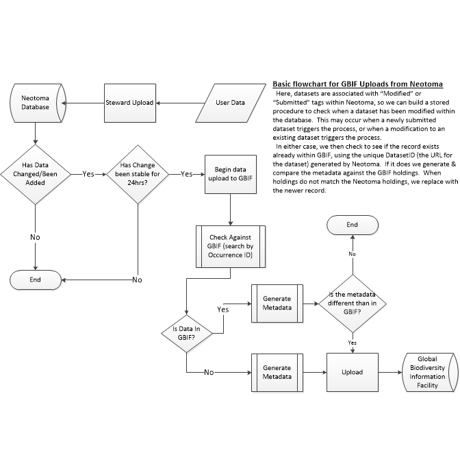

# Introduction

The Neotoma Paleoecological database represents a rich source of data to researchers and the public who may be interested in biodiversity, biogeography and temporal and spatial ecology at long time scales.  The data crosses multiple allied disciplines, from archaeology, geography, biology, paleontology, ecology and, primarily, paleoecology.  The breadth of utility for this data is potentially hampered by the reliance on a single source of access for the data.

To broaden the availability of data from Netoma, we are working with the Global Biodiversity Information Facility (GBIF).  GBIF is an international organization that partners with a number of organizations to make biodiversity data available online.  The use of clear metadata standards, like DarwinCore, make GBIF a useful resource, and the increased size of the data holdings further improve its utility for researchers working on global biodiversity research.

There are three key steps in making Neotoma data available through GBIF.  The first is mapping Neotoma data holdings and concepts onto the metadata standards within GBIF.  This current document is based on [key metadata terms provided by DarwinCore](http://rs.tdwg.org/dwc/terms/), and the ways in which they can represent Neotoma data, across dataset types.  In cases where the current implementation of DarwinCore (or other existing metadata standards such as DublinCore) fails to represent important concepts within Neotoma, we describe new terms that can be used to supplement existing metadata.

The second step is simply scraping the Neotoma Database, both at the dataset level for the initial push, but then secondarily, keeping GBIF up-to-date with Neotoma holdings.

<a id="flowchart"/>

<object data="images/DwC_Upload.svg" type="image/svg+xml" width="600">
  
</object>

To then undertake the mapping of the records, we build a `csv` file for upload, from each individual record within Neotoma using the following mapping:

# Mapping DarwinCore to Neotoma

This is the direct mapping used to generate the Neotoma export to VertNet/DarwinCore.  In places the tables and documents refer to the mapping of various DarwinCore terms to tables and fields within the Neotoma Database.  Neotoma is a SQL Server 2014 database, the format used to refer to specific fields is `XXX.yyy:zzz`, where `XXX` refers to the specific database, in most cases `NDB` for the Neotoma Database.  `yyy` refers to the tables within the Neotoma Database, while `zzz` refers to the specific field within the table.  There is more detail on the related tables within [the online Neotoma Database manual](neotoma-manual.readthedocs.org/en/latest/).

<a id="finalign"/>

## Final Alignment

| DarwinCore | Neotoma |
| ------- | ---------- |
| **dcterms:type** |  Based on [GitHub Issue #1 for the ELC Mapping](https://github.com/EarthLifeConsortium/DwC-Mapping/issues/1) we have chosen to assing this value to `"PhysicalObject"`, since all occurrences originate from PI assignment based on observations, whether the data is legacy or not. |
| **basisOfRecord** | Given the assignment above for `dcterms:type`, the `basisOfRecord` becomes a `Fossil Specimen`. |
| **dcterms:modified** | From `NDB.Datasets:RecDateModified`, the last change to the dataset. |
| **dcterms:language** | For all records this is set to `English`. |
| **dcterms:license** | We assign a [Creative Commons 4.0 License]("http://creativecommons.org/licenses/by/4.0/deed.en_US"), as per the [Neotoma Data Use Policy PDF](http://www.neotomadb.org/uploads/NeotomaDataUsePolicy.pdf) |
| **dcterms.rightsHolder** | We assign the rights to the Contact for the record.  Contact is defined elsewhere, but comes from the `NDB.Contacts:ContactName` table, on the join across dataset, dataset PIs and contacts.  Approximately line 84 in the `functionalized_run.R` file. |
| **dcterms:accessRights** | For all records this is set to `"public"` |
| **dcterms:bibliographicCitation** | This is a concatenation, either of all associated publications, or, in cases where no publication is cited, this is an automatically generated citation, using the dataset ID. |
| **dcterms:Date** | The year of upload to GBIF. |
| **dcterms:references** | A direct link to the Neotoma Explorer App's dataset viewer for that dataset. |
| **locationID** | A link to the Neotoma Explorer App's dataset viewer for that site (would show all  associated datasets). |
| **locality** | The site name, from `NDB.Sites:SiteName` |
| **locationRemarks** | The site description from `NDB.Sites:SiteDescription`. |
| **collectionID** | The term "Neotoma Analysis Unit " concatenated with the `NDB.Sites:AnalysisUnitID` |
| **datasetID** | An *http* link to the JSON dataset-level output. *e.g.* http://api.neotomadb.org/v1/data/datasets/10 |
| **datasetName** |  Concatenation of `NDB.Sites.SiteName`, `NDB.DatasetTypes.DatasetType` + " dataset" |
| **dynamicProperties** | This is currently implemented to store the age uncertainty date, with elements `estimatedSampleAge` (from `NDB.SampleAges:Age`), `latestSampleAge` (from `NDB.SampleAges:AgeOlder`), `earliestSampleAge` (from `NDB.SampleAges:AgeYounger`), `sampleAgeType` (from `NDB.AgeTypes:AgeType`) and `sampleAgeDatum`, currently unimplemented, but intended to act to define age baseline. |
| **occurrenceID** |  Concatenation of `"Neotoma_occ_"`, the `NDB.Samples:AnalysisUnitID`, and `NDB.Taxa:TaxonID` |
| **recordedBy** |  The `NDB.Contacts:ContactName` associated with the dataset. |
| **occurrenceStatus** | `present` in all cases. |
| **associatedReferences** | Pulled from `NDB.Publications:Citation` as a pipe (`|`) separated concatenated list. |
| **eventID** | Should be a unique string.  Currently implemented as `AnalysisUnit_XXX` where `xxx` is from `NDB.AnalysisUnit:AnalysisUnitID`.  Ideally this would be part of the API. |
| **parentEventID** | The parent unit of an Analysis Unit is the Collection Unit: `NDB.CollectionUnit:CollectionUnitID` |
| **eventDate** | The `NDB.CollectionUnit:CollDate` using the `POSIX` `'%Y-%m-%d'` format. [Consistent with other examples.](http://portal.vertnet.org/o/rom/vertebrate-palaeontology?id=uri-catalog-rom-palaeobiology-vertebrate-fossils-52705) |
| **startDayOfYear** | Returns the Julian numeric day (`POSIX`: `%j`) for the event date. |
| **endDayOfYear** | Returns the Julian numeric day (`POSIX`: `%j`) for the event date. |
| **year** | Returns the `POSIX` year `%Y`.  |
| **month** | Returns the `POSIX` month `%m`. |
| **day** | Returns the `POSIX` day `%d`. |
| **samplingProtocol** | Comes out as `"Neotoma " + NDB.DatasetType:DatasetType + " dataset"` |
| **sampleSizeValue** |  `NDB.Data.Value` |
| **sampleSizeUnit** | Comes from `NDB.VariableUnits:VariableUnits`  |
| **eventRemarks** | `NDB.CollectionUnit:Notes` |
| **minimumElevationInMeters** | `NDB.Sites:Altitude` is a single value. |
| **maximumElevationInMeters** | `NDB.Sites:Altitude` |
| **decimalLatitude** |  `NDB.Sites:LatitudeNorth` and `NDB.Sites:LatitudeSouth`. |
| **decimalLongitude** | `NDB.Sites:LongitudeEast` and `NDB.Sites:LongitudeWest`. |
| **geodeticDatum** | `EPSG:4326` |
| **coordinatePrecision** | Uses the `NDB.Sites` location information, but additionally converts to DMS to check whether or not a value is rounded to the nearest minute or second. |
| **footprintWKT** | WKT Polygon using the `NDB:Sites` spatial information (excepting altitude). |
| **footprintSRS** | `GEOGCS["GCS_WGS_1984",DATUM["D_WGS_1984",SPHEROID["WGS_1984",6378137,298.257223563]],PRIMEM["Greenwich",0],UNIT["Degree",0.0174532925199433]]` |
| **georeferencedBy** | The `NDB.Contacts:ContactName` associated with the dataset. |
| **earliestEonOrLowestEonothem** | [`Phanerozoic`](https://en.wikipedia.org/wiki/Phanerozoic) for all records. |
| **latestEonOrHighestEonothem** |  [`Phanerozoic`](https://en.wikipedia.org/wiki/Phanerozoic) for all records. |
| **earliestEraOrLowestErathem** |  Pulled from `NDB.SampleAges:Age`, `NDB.SampleAges:AgeOlder` and `NDB.SampleAges:AgeYounger` against geological ages. |
| **latestEraOrHighestErathem** |  Pulled from `NDB.SampleAges:Age`, `NDB.SampleAges:AgeOlder` and `NDB.SampleAges:AgeYounger` against geological ages. |
| **earliestPeriodOrLowestSystem** |  Pulled from `NDB.SampleAges:Age`, `NDB.SampleAges:AgeOlder` and `NDB.SampleAges:AgeYounger` against geological ages. |
| **latestPeriodOrHighestSystem** |  Pulled from `NDB.SampleAges:Age`, `NDB.SampleAges:AgeOlder` and `NDB.SampleAges:AgeYounger` against geological ages. |
| **earliestEpochOrLowestSeries** |  Pulled from `NDB.SampleAges:Age`, `NDB.SampleAges:AgeOlder` and `NDB.SampleAges:AgeYounger` against geological ages. |
| **latestEpochOrHighestSeries** |  Pulled from `NDB.SampleAges:Age`, `NDB.SampleAges:AgeOlder` and `NDB.SampleAges:AgeYounger` against geological ages. |
| **earliestAgeOrLowestStage** |  Pulled from `NDB.SampleAges:Age`, `NDB.SampleAges:AgeOlder` and `NDB.SampleAges:AgeYounger` against geological ages. |
| **latestAgeOrHighestStage** | Pulled from `NDB.SampleAges:Age`, `NDB.SampleAges:AgeOlder` and `NDB.SampleAges:AgeYounger` against geological ages.  |
| **identificationQualifier** | Pulling for qualifiers using regular expression searching in the `NDB.Taxon:ScientificName` |
| **taxonID** | Concatenation of `"Neotoma_taxon - "` and `NDB.Taxon:TaxonID` |
| **identifiedBy** | The `NDB.Contacts:ContactName` associated with the dataset. |
| **scientificName** | `NDB.Taxon:ScientificName`, but with the `identificationQualifier` removed. |
| **scientificNameAuthorship** | `NDB.Taxon:Author` |
| **associatedTaxa** | Concatenates all other taxa in the analysis unit using a pipe (`|`) |
| **associatedOccurrences** | Concatenates all other occurrences using a pipe. |
| **samplingEffort** | Sum of all sample counts within the same Collection Unit and with the same `sampleSizeUnit` (which allows for mixed samples, *e.g.* with both MNI and NISP) |
| **country** | `NDB.SiteGeoPolitical:GeoPoliticalName` where `NDB.SiteGeoPolitical:GeoPoliticalUnit` is `country`. |
| **stateProvince** | `NDB.SiteGeoPolitical:GeoPoliticalName` where `NDB.SiteGeoPolitical:GeoPoliticalUnit` is one of `(^province)|(^territory)|(state \\()|(^state$)`. |

## All DarwinCore Fields - Reference

### Record Level Terms

| Implemented | Neotoma | DarwinCore | Description |
| ----------- | ------- | ---------- | ---------- |
| * | `"Dataset"` | [`dcterms:type`](http://rs.tdwg.org/dwc/terms/index.htm#dcterms:type) | The nature or genre of the resource. For Darwin Core, recommended best practice is to use the name of the class that defines the root of the record. |
| * | `Datasets:RecDateModified` | [`dcterms:modified`](http://rs.tdwg.org/dwc/terms/index.htm#dcterms:modified) | The most recent date-time on which the resource was changed. For Darwin Core, recommended best practice is to use an encoding scheme, such as ISO 8601:2004(E). |
| * | `"en-US"`  | dcterms:language | A language of the resource. Recommended best practice is to use a controlled vocabulary such as RFC 4646 [RFC4646]. |
| * | [CC-BY-4.0](http://creativecommons.org/licenses/by/4.0/deed.en_US) | dcterms:license | |
| * | `Contacts:ContactName` | dcterms:rightsHolder | A person or organization owning or managing rights over the resource. |
| * | `"public"` | dcterms:accessRights | Information about who can access the resource or an indication of its security status. |
| * | `DatasetPublications:Citation` | dcterms:bibliographicCitation | A bibliographic reference for the resource as a statement indicating how this record should be cited (attributed) when used. Recommended practice is to include sufficient bibliographic detail to identify the resource as unambiguously as possible. |
| * | submission date | `dcterms:year` | The year of data submission. |
| * | Explorer link | `dcterms:references` | A related resource that is referenced, cited, or otherwise pointed to by the described resource. |
|   | IGSNs for samples? | institutionID | An identifier for the institution having custody of the object(s) or information referred to in the record. |
| * | `AnalysisUnitID:AnalysisUnits`| collectionID | An identifier for the collection or dataset from which the record was derived. |
| * | API link to `DatasetID:Datasets` | datasetID | An identifier for the set of data. May be a global unique identifier or an identifier specific to a collection or institution. |
|   | `RepositoryInstitutions:Acronym` | institutionCode | The name (or acronym) in use by the institution having custody of the object(s) or information referred to in the record. |
|  | | collectionCode | The name, acronym, coden, or initialism identifying the collection or data set from which the record was derived. |
| * | SiteName + Sampling Protocol + `'dataset'` | datasetName | The name identifying the data set from which the record was derived. |
|  | | ownerInstitutionCode | The name (or acronym) in use by the institution having ownership of the object(s) or information referred to in the record. |
|  | | basisOfRecord | The specific nature of the data record. |
|  | | informationWithheld | Additional information that exists, but that has not been shared in the given record. |
|  | | dataGeneralizations | Actions taken to make the shared data less specific or complete than in its original form. Suggests that alternative data of higher quality may be available on request. |
| * | Age terms | dynamicProperties | 	A list of additional measurements, facts, characteristics, or assertions about the record. Meant to provide a mechanism for structured content. JSON structured: "{"thing":value}" |

### Occurrence

| Implemented | Neotoma | DarwinCore | Description |
| ----------- | ------- | ---------- | ---------- |
| * | `AnalysisUnits:AnalysisUnitID` + `TaxonID` | occurrenceID | An identifier for the Occurrence (as opposed to a particular digital record of the occurrence). In the absence of a persistent global unique identifier, construct one from a combination of identifiers in the record that will most closely make the occurrenceID globally unique. |
|  | | catalogNumber | An identifier (preferably unique) for the record within the data set or collection. |
|  | | recordNumber | An identifier given to the Occurrence at the time it was recorded. Often serves as a link between field notes and an Occurrence record, such as a specimen collector's number. |
| * | `DatasetPI` or `Contacts:ContactName` | recordedBy | A list (concatenated and separated) of names of people, groups, or organizations responsible for recording the original Occurrence. The primary collector or observer, especially one who applies a personal identifier (recordNumber), should be listed first.
|  | Pollen grains are not individuals, could work with `MNI` counts | individualCount | The number of individuals represented present at the time of the Occurrence. |
|  | | organismQuantity | A number or enumeration value for the quantity of organisms. |
|  | | organismQuantityType | The type of quantification system used for the quantity of organisms. |
|  | | sex | The sex of the biological individual(s) represented in the Occurrence. Recommended best practice is to use a controlled vocabulary. |
|  | | lifeStage | The age class or life stage of the biological individual(s) at the time the Occurrence was recorded. Recommended best practice is to use a controlled vocabulary. |
|  | | reproductiveCondition | The reproductive condition of the biological individual(s) represented in the Occurrence. Recommended best practice is to use a controlled vocabulary. |
|  | | behavior | A description of the behavior shown by the subject at the time the Occurrence was recorded. Recommended best practice is to use a controlled vocabulary. |
|  | | establishmentMeans | The process by which the biological individual(s) represented in the Occurrence became established at the location. Recommended best practice is to use a controlled vocabulary. |
| * | `present` | occurrenceStatus | A statement about the presence or absence of a Taxon at a Location. Recommended best practice is to use a controlled vocabulary. |
|  | | preparations | A list (concatenated and separated) of preparations and preservation methods for a specimen. |
|  | | disposition | The current state of a specimen with respect to the collection identified in collectionCode or collectionID. Recommended best practice is to use a controlled vocabulary. |
|  | | associatedMedia | A list (concatenated and separated) of identifiers (publication, global unique identifier, URI) of media associated with the Occurrence. |
| * | `Publications:Citation` pipe separated | associatedReferences | A list (concatenated and separated) of identifiers (publication, bibliographic reference, global unique identifier, URI) of literature associated with the Occurrence. |
|  | | associatedSequences | A list (concatenated and separated) of identifiers (publication, global unique identifier, URI) of genetic sequence information associated with the Occurrence. |
| * | `"cooccurrs with: "` | associatedTaxa | A list (concatenated and separated) of identifiers or names of taxa and their associations with the Occurrence. |
|  | | otherCatalogNumbers | A list (concatenated and separated) of previous or alternate fully qualified catalog numbers or other human-used identifiers for the same Occurrence, whether in the current or any other data set or collection. |
|  |  | occurrenceRemarks | Comments or notes about the Occurrence. |

### Organism

| Implemented | Neotoma | DarwinCore | Description |
| ----------- | ------- | ---------- | ---------- |
|  | | organismID | 	An identifier for the Organism instance (as opposed to a particular digital record of the Organism). May be a globally unique identifier or an identifier specific to the data set. |
|  | | organismName | A textual name or label assigned to an Organism instance. |
|  | | organismScope | A description of the kind of Organism instance. Can be used to indicate whether the Organism instance represents a discrete organism or if it represents a particular type of aggregation. Recommended best practice is to use a controlled vocabulary.  |
| * | Same as `associatedTaxa`, but with Occurrence IDs |  associatedOccurrences | A list (concatenated and separated) of identifiers of other Occurrence records and their associations to this Occurrence. |
|  | |  associatedOrganisms | A list (concatenated and separated) of identifiers of other Organisms and their associations to this Organism. |
|  | |  previousIdentifications | A list (concatenated and separated) of previous assignments of names to the Organism. |
|  | |  organismRemarks | Comments or notes about the Organism instance. |

### MaterialSample, LivingSpecimen, PreservedSpecimen, FossilSpecimen

| Implemented | Neotoma | DarwinCore | Description |
| ----------- | ------- | ---------- | ---------- |
|  | IGSN | materialSampleID | An identifier for the MaterialSample (as opposed to a particular digital record of the material sample). In the absence of a persistent global unique identifier, construct one from a combination of identifiers in the record that will most closely make the materialSampleID globally unique. |

### Event, HumanObservation, MachineObservation

| Implemented | Neotoma | DarwinCore | Description |
| ----------- | ------- | ---------- | ---------- |
| * | `AnalysisUnitID` | eventID | An identifier for the set of information associated with an Event (something that occurs at a place and time). May be a global unique identifier or an identifier specific to the data set. |
| * | `CollectionUnitID` | parentEventID | An identifier for the broader Event that groups this and potentially other Events. |
|  | | fieldNumber | An identifier given to the event in the field. Often serves as a link between field notes and the Event. |
| * | `CollectionUnits:CollDate` | eventDate | The date-time or interval during which an Event occurred. For occurrences, this is the date-time when the event was recorded. **Not suitable for a time in a geological context.** Recommended best practice is to use an encoding scheme, such as ISO 8601:2004(E). |
|  | | eventTime | The time or interval during which an Event occurred. Recommended best practice is to use an encoding scheme, such as ISO 8601:2004(E). |
| * | `1` | startDayOfYear | The earliest ordinal day of the year on which the Event occurred (1 for January 1, 365 for December 31, except in a leap year, in which case it is 366). |
| * | `365` or `366`| endDayOfYear | The latest ordinal day of the year on which the Event occurred (1 for January 1, 365 for December 31, except in a leap year, in which case it is 366). |
| * | get year from `CollectionUnits:CollDate` | year | The four-digit year in which the Event occurred, according to the Common Era Calendar. |
| * | get month from `CollectionUnits:CollDate` | month | The ordinal month in which the Event occurred. |
| * | get day from `CollectionUnits:CollDate` | day | The integer day of the month on which the Event occurred. |
|  | | verbatimEventDate | The verbatim original representation of the date and time information for an Event. |
|  | | habitat | A category or description of the habitat in which the Event occurred. |
| * | `Datasets:datasettype` | samplingProtocol | The name of, reference to, or description of the method or protocol used during an Event. |
| * | `Data:value` | sampleSizeValue | A numeric value for a measurement of the size (time duration, length, area, or volume) of a sample in a sampling event. |
| * | `VariableUnits:VariableUnit` | sampleSizeUnit | The unit of measurement of the size (time duration, length, area, or volume) of a sample in a sampling event. |
|  | Total count for the analysis unit | samplingEffort | The amount of effort expended during an Event. |
| | | fieldNotes | One of a) an indicator of the existence of, b) a reference to (publication, URI), or c) the text of notes taken in the field about the Event. |
| * | `CollectionUnits:Notes` | eventRemarks | Comments or notes about the Event. |

### Location

| Implemented | Neotoma | DarwinCore | Description |
| ----------- | ------- | ---------- | ---------- |
|  | | locationID | An identifier for the set of location information (data associated with dcterms:Location). May be a global unique identifier or an identifier specific to the data set. |
| * | `GeopoliticalUnits` | higherGeographyID | An identifier for the geographic region within which the Location occurred. Recommended best practice is to use an persistent identifier from a controlled vocabulary such as the Getty Thesaurus of Geographic Names. |
| * | `GeopoliticalUnits` | higherGeography | A list (concatenated and separated) of geographic names less specific than the information captured in the locality term. |
|  | | continent | The name of the continent in which the Location occurs. Recommended best practice is to use a controlled vocabulary such as the Getty Thesaurus of Geographic Names. |
|  | | waterBody | The name of the water body in which the Location occurs. Recommended best practice is to use a controlled vocabulary such as the Getty Thesaurus of Geographic Names. |
|  | | islandGroup | The name of the island group in which the Location occurs. Recommended best practice is to use a controlled vocabulary such as the Getty Thesaurus of Geographic Names. |
|  | | island | The name of the island on or near which the Location occurs. Recommended best practice is to use a controlled vocabulary such as the Getty Thesaurus of Geographic Names. |
| * | `GeoPoliticalUnits:GeoPoliticalName` | country | The name of the country or major administrative unit in which the Location occurs. Recommended best practice is to use a controlled vocabulary such as the Getty Thesaurus of Geographic Names. |
| * | `GeopoliticalUnits` | countryCode | The standard code for the country in which the Location occurs. Recommended best practice is to use ISO 3166-1-alpha-2 country codes. |
| * | `GeopoliticalUnits` | stateProvince | The name of the next smaller administrative region than country (state, province, canton, department, region, etc.) in which the Location occurs. |
|  | | county | The full, unabbreviated name of the next smaller administrative region than stateProvince (county, shire, department, etc.) in which the Location occurs. |
|  | | municipality | The full, unabbreviated name of the next smaller administrative region than county (city, municipality, etc.) in which the Location occurs. Do not use this term for a nearby named place that does not contain the actual location. |
|  | | locality | The specific description of the place. Less specific geographic information can be provided in other geographic terms (higherGeography, continent, country, stateProvince, county, municipality, waterBody, island, islandGroup). This term may contain information modified from the original to correct perceived errors or standardize the description. |
|  | | verbatimLocality | The original textual description of the place. |
|  | `Sites:Altitude` | minimumElevationInMeters | The lower limit of the range of elevation (altitude, usually above sea level), in meters. |
|  | `Sites:Altitude` | maximumElevationInMeters | The upper limit of the range of elevation (altitude, usually above sea level), in meters. |
|  | | verbatimElevation | The original description of the elevation (altitude, usually above sea level) of the Location. |
|  | | minimumDepthInMeters | The lesser depth of a range of depth below the local surface, in meters. |
|  | | maximumDepthInMeters | The greater depth of a range of depth below the local surface, in meters. |
|  | | verbatimDepth | The original description of the depth below the local surface. |
|  | | minimumDistanceAboveSurfaceInMeters | The lesser distance in a range of distance from a reference surface in the vertical direction, in meters. Use positive values for locations above the surface, negative values for locations below. If depth measures are given, the reference surface is the location given by the depth, otherwise the reference surface is the location given by the elevation. |
|  | | maximumDistanceAboveSurfaceInMeters | The greater distance in a range of distance from a reference surface in the vertical direction, in meters. Use positive values for locations above the surface, negative values for locations below. If depth measures are given, the reference surface is the location given by the depth, otherwise the reference surface is the location given by the elevation. |
|  | | locationAccordingTo | Information about the source of this Location information. Could be a publication (gazetteer), institution, or team of individuals. |
| * | `Sites:SiteDescription` | locationRemarks | Comments or notes about the Location. |
| * | `Sites:LongitudeEast` | decimalLatitude | The geographic latitude (in decimal degrees, using the spatial reference system given in geodeticDatum) of the geographic center of a Location. Positive values are north of the Equator, negative values are south of it. Legal values lie between -90 and 90, inclusive. |
| * | `Sites:LatitudeNorth` | decimalLongitude | The geographic longitude (in decimal degrees, using the spatial reference system given in geodeticDatum) of the geographic center of a Location. Positive values are east of the Greenwich Meridian, negative values are west of it. Legal values lie between -180 and 180, inclusive. |
| * | `EPSG:4326` | geodeticDatum | The ellipsoid, geodetic datum, or spatial reference system (SRS) upon which the geographic coordinates given in decimalLatitude and decimalLongitude as based. Recommended best practice is use the EPSG code as a controlled vocabulary to provide an SRS, if known. Otherwise use a controlled vocabulary for the name or code of the geodetic datum, if known. Otherwise use a controlled vocabulary for the name or code of the ellipsoid, if known. If none of these is known, use the value "unknown". |
|  | | coordinateUncertaintyInMeters | The horizontal distance (in meters) from the given decimalLatitude and decimalLongitude describing the smallest circle containing the whole of the Location. Leave the value empty if the uncertainty is unknown, cannot be estimated, or is not applicable (because there are no coordinates). Zero is not a valid value for this term. |
| * | `max(c(Sites:LongitudeEast - Sites:LongitudeWest,` \n `Sites:LatitudeNorth - Sites:LatitudeSouth))` | coordinatePrecision | A decimal representation of the precision of the coordinates given in the decimalLatitude and decimalLongitude. |
|  | | pointRadiusSpatialFit | The ratio of the area of the point-radius (decimalLatitude, decimalLongitude, coordinateUncertaintyInMeters) to the area of the true (original, or most specific) spatial representation of the Location. Legal values are 0, greater than or equal to 1, or undefined. A value of 1 is an exact match or 100% overlap. A value of 0 should be used if the given point-radius does not completely contain the original representation. The pointRadiusSpatialFit is undefined (and should be left blank) if the original representation is a point without uncertainty and the given georeference is not that same point (without uncertainty). If both the original and the given georeference are the same point, the pointRadiusSpatialFit is 1. |
|  | | verbatimCoordinates | The verbatim original spatial coordinates of the Location. The coordinate ellipsoid, geodeticDatum, or full Spatial Reference System (SRS) for these coordinates should be stored in verbatimSRS and the coordinate system should be stored in verbatimCoordinateSystem. |
|  | | verbatimLatitude | The verbatim original latitude of the Location. The coordinate ellipsoid, geodeticDatum, or full Spatial Reference System (SRS) for these coordinates should be stored in verbatimSRS and the coordinate system should be stored in verbatimCoordinateSystem. |
|  | | verbatimLongitude | The verbatim original longitude of the Location. The coordinate ellipsoid, geodeticDatum, or full Spatial Reference System (SRS) for these coordinates should be stored in verbatimSRS and the coordinate system should be stored in verbatimCoordinateSystem. |
|  | | verbatimCoordinateSystem | 	The spatial coordinate system for the verbatimLatitude and verbatimLongitude or the verbatimCoordinates of the Location. Recommended best practice is to use a controlled vocabulary. |
|  | | verbatimSRS | The ellipsoid, geodetic datum, or spatial reference system (SRS) upon which coordinates given in verbatimLatitude and verbatimLongitude, or verbatimCoordinates are based. Recommended best practice is use the EPSG code as a controlled vocabulary to provide an SRS, if known. Otherwise use a controlled vocabulary for the name or code of the geodetic datum, if known. Otherwise use a controlled vocabulary for the name or code of the ellipsoid, if known. If none of these is known, use the value "unknown". |
| * | e.g., `POLYGON ((10 20, 11 20, 11 21, 10 21, 10 20))` | footprintWKT | A Well-Known Text (WKT) representation of the shape (footprint, geometry) that defines the Location. A Location may have both a point-radius representation (see decimalLatitude) and a footprint representation, and they may differ from each other. |
|  |  | footprintSRS | A Well-Known Text (WKT) representation of the Spatial Reference System (SRS) for the footprintWKT of the Location. Do not use this term to describe the SRS of the decimalLatitude and decimalLongitude, even if it is the same as for the footprintWKT - use the geodeticDatum instead. |
|  | | footprintSpatialFit | The ratio of the area of the footprint (footprintWKT) to the area of the true (original, or most specific) spatial representation of the Location. Legal values are 0, greater than or equal to 1, or undefined. A value of 1 is an exact match or 100% overlap. A value of 0 should be used if the given footprint does not completely contain the original representation. The footprintSpatialFit is undefined (and should be left blank) if the original representation is a point and the given georeference is not that same point. If both the original and the given georeference are the same point, the footprintSpatialFit is 1. |
| * | `DatasetPI` | georeferencedBy | A list (concatenated and separated) of names of people, groups, or organizations who determined the georeference (spatial representation) for the Location. |
|  | | georeferencedDate | |
|  | | georeferenceProtocol | |
|  | | georeferenceSources | |
|  | | georeferenceVerificationStatus | |
|  | | georeferenceRemarks | |

### GeologicalContext

| Implemented | Neotoma | DarwinCore | Description |
| ----------- | ------- | ---------- | ---------- |
|  | | geologicalContextID | An identifier for the set of information associated with a GeologicalContext (the location within a geological context, such as stratigraphy). May be a global unique identifier or an identifier specific to the data set. |
| * | `"Phanerozoic"` | earliestEonOrLowestEonothem | |
| * | `"Phanerozoic"` | latestEonOrHighestEonothem | |
| * | `"Cenozoic"` | earliestEraOrLowestErathem | |
| * | `"Cenozoic"` | latestEraOrHighestErathem | |
| * | `"Quaternary"` - but check | earliestPeriodOrLowestSystem | |
| * | `"Quaternary"` - but check | latestPeriodOrHighestSystem | |
| * | `"Holocene"` or `"Pleistocene"` - but check | earliestEpochOrLowestSeries | |
| * | `"Holocene"` or `"Pleistocene"` - but check | latestEpochOrHighestSeries | |
|  |  | earliestAgeOrLowestStage | |
|  |  | latestAgeOrHighestStage | The full name of the latest possible geochronologic age or highest chronostratigraphic stage attributable to the stratigraphic horizon from which the cataloged item was collected. |
|  | | lowestBiostratigraphicZone | |
|  | | highestBiostratigraphicZone | |
|  | `Lithology:Description` | lithostratigraphicTerms |  **Note**: This is complicated, you need to find depth & lithographic terms.|
|  | | group | |
|  | | formation | |
|  | | member | |
|  | | bed | |

### Identification

| Implemented | Neotoma | DarwinCore | Description |
| ----------- | ------- | ---------- | ---------- |
|  | | identificationID | |
|  | regex search for key qualifiers (*e.g.*, ?, cf, type) | identificationQualifier | A brief phrase or a standard term ("cf.", "aff.") to express the determiner's doubts about the Identification. |
|  | | typeStatus | A list (concatenated and separated) of nomenclatural types (type status, typified scientific name, publication) applied to the subject. |
| * | `DatasetPI` | identifiedBy | A list (concatenated and separated) of names of people, groups, or organizations who assigned the Taxon to the subject. |
|  | | dateIdentified | The date on which the subject was identified as representing the Taxon. Recommended best practice is to use an encoding scheme, such as ISO 8601:2004(E). |
|  | | identificationReferences | A list (concatenated and separated) of references (publication, global unique identifier, URI) used in the Identification. |
|  | | identificationVerificationStatus | A categorical indicator of the extent to which the taxonomic identification has been verified to be correct. Recommended best practice is to use a controlled vocabulary such as that used in HISPID/ABCD. |
|  | | identificationRemarks | Comments or notes about the Identification. |

### Taxon

| Implemented | Neotoma | DarwinCore | Description |
| ----------- | ------- | ---------- | ---------- |
|  | | taxonID | An identifier for the set of taxon information (data associated with the Taxon class). May be a global unique identifier or an identifier specific to the data set. |
|  | `Taxa:TaxonID` | scientificNameID | An identifier for the nomenclatural (not taxonomic) details of a scientific name. |
|  | | acceptedNameUsageID | An identifier for the name usage (documented meaning of the name according to a source) of the currently valid (zoological) or accepted (botanical) taxon. |
|  | | parentNameUsageID | 	An identifier for the name usage (documented meaning of the name according to a source) of the direct, most proximate higher-rank parent taxon (in a classification) of the most specific element of the scientificName. |
|  | | originalNameUsageID | An identifier for the name usage (documented meaning of the name according to a source) in which the terminal element of the scientificName was originally established under the rules of the associated nomenclaturalCode. |
|  | | nameAccordingToID | An identifier for the source in which the specific taxon concept circumscription is defined or implied. See nameAccordingTo. |
| * | `Taxa:PublicationID` | namePublishedInID | An identifier for the publication in which the scientificName was originally established under the rules of the associated nomenclaturalCode. |
|  | | taxonConceptID | An identifier for the taxonomic concept to which the record refers - not for the nomenclatural details of a taxon. |
| * | `Taxa:TaxonName` | scientificName | The full scientific name, with authorship and date information if known. When forming part of an Identification, this should be the name in lowest level taxonomic rank that can be determined. This term should not contain identification qualifications, which should instead be supplied in the identificationQualifier term. |
|  | | acceptedNameUsage | The full name, with authorship and date information if known, of the currently valid (zoological) or accepted (botanical) taxon. |
|  | | parentNameUsage | 	The full name, with authorship and date information if known, of the direct, most proximate higher-rank parent taxon (in a classification) of the most specific element of the scientificName. |
|  | | originalNameUsage | The taxon name, with authorship and date information if known, as it originally appeared when first established under the rules of the associated nomenclaturalCode. The basionym (botany) or basonym (bacteriology) of the scientificName or the senior/earlier homonym for replaced names. |
|  | | nameAccordingTo | The reference to the source in which the specific taxon concept circumscription is defined or implied - traditionally signified by the Latin "sensu" or "sec." (from secundum, meaning "according to"). For taxa that result from identifications, a reference to the keys, monographs, experts and other sources should be given. |
|  | | namePublishedIn | A reference for the publication in which the scientificName was originally established under the rules of the associated nomenclaturalCode. |
|  | | namePublishedInYear | The four-digit year in which the scientificName was published. |
|  | | higherClassification | A list (concatenated and separated) of taxa names terminating at the rank immediately superior to the taxon referenced in the taxon record. |
|  | | kingdom | The full scientific name of the kingdom in which the taxon is classified. |
|  | | phylum | The full scientific name of the phylum or division in which the taxon is classified. |
|  | | class | |
|  | | order | |
|  | | family | |
|  | | genus | |
|  | | subgenus | |
|  | | specificEpithet | |
|  | | infraspecificEpithet | |
|  | | taxonRank | |
|  | | verbatimTaxonRank | |
| * | `Taxa:Author` | scientificNameAuthorship | The authorship information for the scientificName formatted according to the conventions of the applicable nomenclaturalCode. |
|  | |  vernacularName | A common or vernacular name. |
|  | | nomenclaturalCode | The nomenclatural code (or codes in the case of an ambiregnal name) under which the scientificName is constructed. Recommended best practice is to use a controlled vocabulary. |
|  | | taxonomicStatus | The status of the use of the scientificName as a label for a taxon. Requires taxonomic opinion to define the scope of a taxon. Rules of priority then are used to define the taxonomic status of the nomenclature contained in that scope, combined with the experts opinion. It must be linked to a specific taxonomic reference that defines the concept. Recommended best practice is to use a controlled vocabulary. |
|  | | nomenclaturalStatus | The status related to the original publication of the name and its conformance to the relevant rules of nomenclature. It is based essentially on an algorithm according to the business rules of the code. It requires no taxonomic opinion. |
|  | | taxonRemarks | Comments or notes about the taxon or name. |

### Auxiliary Terms
#### MeasurementOrFact

| Implemented | Neotoma | DarwinCore | Description |
| ----------- | ------- | ---------- | ---------- |
| | measurementID | | |
| | measurementType | | |
| | measurementValue | |  |
| | measurementAccuracy | | |
| | measurementUnit | |  |
| | measurementDeterminedBy | | |
| | measurementDeterminedDate | | |
| | measurementMethod | | |
| | measurementRemarks| | |

#### ResourceRelationship

| Implemented | Neotoma | DarwinCore | Description |
| ----------- | ------- | ---------- | ---------- |
| | | resourceRelationshipID | An identifier for a related resource (the object, rather than the subject of the relationship). |
| | | resourceID | |
| | | relatedResourceID | |
| | | relationshipOfResource | The relationship of the resource identified by relatedResourceID to the subject (optionally identified by the resourceID). Recommended best practice is to use a controlled vocabulary. |
| | | relationshipAccordingTo | |
| | | relationshipEstablishedDate | |
| | | relationshipRemarks| Comments or notes about the relationship between the two resources. |

# Scraping Neotoma

The code runs programmatically, using the script [`functionalized_run.R`](https://github.com/NeotomaDB/DwC-Mapping/blob/master/functionalized_run.R).  The script operates across each dataset within Neotoma, generating a CSV file with the content, as described above.  If the dataset is one of `'geochronologic'`, `'loss-on-ignition'`, `'paleomagnetic'`, `'energy dispersive X-ray spectroscopy (EDS/EDX)'`, `'X-ray diffraction (XRD)'`, `'X-ray fluorescence (XRF)'`, `'charcoal'`, `'physical sedimentology'`, `'geochemistry'`, and `'water chemistry'`.  These records have no biological information associated with them, and as such will not be exported.

In the case that the SQL query returns a `data.frame` with no content, but is a valid dataset-type, then the returned file is pre-pended with the term `empty`.  As such, a file is generated, but the file is marked as empty.  In cases where the dataset is a valid dataset type, but contains only data from non-biological taxon groups (`"LAB"`, `"LOI"`, `"MAG"`, `"ISO"`, `"BIM"`, `"CHM"`, `"WCH"`, `"GCH"`, `"CHR"`, or `"SED"`), then the record is again returned as `empty`.  `duplicated_` records may be returned if there are Collection Units with duplicated rows.

For other records, a csv is returned with the fields described in the [Final Alignment](#finalign).  Otherwise, the file is written with the name `NNNN_test_YYYY.csv`, where `NNNN` represents the dataset number and `YYYY` represents the dataset type.

# Setting Triggers and Data Upload

As indicated in the [flow chart](#flowchart) above, there will be an initial bulk upload of data to GBIF/VertNet.  Following this initial upload, data will be tracked, based on the initial upload date, and a query will be executed.  If the date of last update within the tables is more recent than the last upload date, then the record will be updated.  However, before the record is uploaded, it will be compared to the original file.  If the files are different, we'll proceed with upload, otherwise, the new file will replace the other locally, but not on GBIF.

# Conclusion

Improving accessibility for Neotoma records is important for the database community.  It provides data contributors with a broader audience for their work, it provides researchers with a broader set of available data.