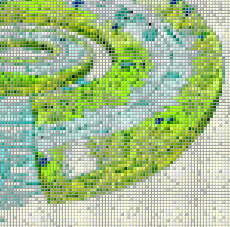

<!-- badges: start -->

<!-- badges: end -->

# Mapping Neotoma against the DarwinCore Schema

This repository tracks the development of efforts to map Neotoma dataset records against the [DarwinCore](http://rs.tdwg.org/dwc/) schema to facilitate greater data discovery, reuse and sustainability of records archived within the Neotoma Paleoecological Database.  This project is part of the EarthCube Integrative Activities proposal between Neotoma and the Paleobiological Database, and is one step along the path to upload Neotoma records to [BISON](http://bison.usgs.ornl.gov/) and [GBIF](http://www.gbif.org/).

Initial work on this project was made possible through collaboration as part of the Cyber4Paleo Community Development Workshop in Boulder, CO, July, 2016.  Much of this work is archived as part of the Cyber4Paleo [GitHub organization](http://github.com/cyber4paleo) and [GitHub pages](cyber4paleo.github.io).

This work is carried out by the [Earthlife Consortium](http://github.com/earthlifeconsortium), funded by NSF through the EarthCube initiative.

## Contributors

*We welcome contributions from any individual, whether code, documentation, or issue tracking.  All participants are expected to follow the [code of conduct](https://github.com/neotomadb/DwC-Mapping/blob/master/code_of_conduct.md) for this project.*

* [Simon Goring](http://simongoring.github.io) - Assistant Scientist, University of Wisconsin
* [Jack Williams](https://github.com/iceageecologist) - Professor, University of Wisconsin
* [Mark Uhen](http://github.com/markuhen) - George Mason University
* [Michael McClennan](https://github.com/mmcclenn) - University of Wisconsin - Madison
* [John Wieczorek](http://github.com/tucotuco) - Information Architect, University of California, Berkeley

## Description

Mapping the Neotoma Database structure onto DarwinCore standards is relatively complex.  While some of the data structure maps easily, the content of the database, and the conceptual structure of the paleoecological records is not consistently equivalent to the semantic structure of the DarwinCore schema.  The `Rmd` has some simple relationships described in the markdown portion of the document, based on a cross-walk started by Michael McClennan, and extended by Jack Williams and Mark Uhen at the [Cyber4Paleo Community Development Workshop](http://cyber4paleo.github.io).  Simon Goring developed the `Rmd` and implemented the actual conversion of the database structure to the `csv` file output.

## How to Use this Repository

The database itself is available as a SQL Server snapshot from the Neotoma Paleoecological Database's website [here](http://www.neotomadb.org/snapshots), or on [figshare.org]() at the [Neotoma Database Snapshot project](https://figshare.com/authors/Data_Backup_Neotoma_Paleoecological_Database/2741398).

With the snapshot loaded into your local server, replace the connection string in `functionalized_run.R` (around line 27) and the code should "just run", provided you have the required packages.  In this case you need libraries `RODBC`, `neotoma`, `dplyr` and `tidyr`.

### Key TODOs

* If there are missing fields, or poorly coded fields, feel free to provide suggestions.
* If there are efficiencies in coding, feel free to provide them
* If you feel documentation is incomplete, feel free to suggest imrpovements
* I'd (ideally)like to improve the `Rmd` so that it is, in some sense, publishable as a data/methods paper.  We welcome contribution that would assist in this effort.  If you feel like you would be able to contribute significantly enough to be considered an author please **contact us first**.

## Support

This work is supported through the National Science Foundation's [EarthCube Initiative](earthcube.org) through NSF Award Numbers [1541002](http://www.nsf.gov/awardsearch/showAward?AWD_ID=1541002) and [1340301](http://www.nsf.gov/awardsearch/showAward?AWD_ID=1340301&HistoricalAwards=false).

